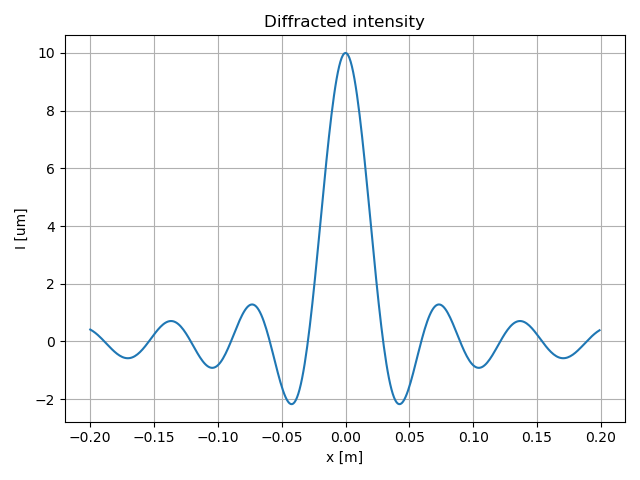

# Units and measurements

## Base quantity
The `base_quantity` struct represents a physical quantity by storing the powers of the seven base quantities of the International System of Units ([SI](https://en.wikipedia.org/wiki/International_System_of_Units)) - `length`, `time`, `mass`, `temperature`, `electric_current`, `substance_amount`, and `luminous_intensity`, as template parameters:
```cpp
template <int LENGTH, int TIME, int MASS, int TEMPERATURE, 
          int ELETTRIC_CURRENT, int SUBSTANCE_AMOUNT, int LUMINOUS_INTENSITY>
struct base_quantity {

    static constexpr std::array<int, 7> powers = {LENGTH, TIME, MASS, TEMPERATURE, ELETTRIC_CURRENT, SUBSTANCE_AMOUNT, LUMINOUS_INTENSITY}; ///< array of the powers of the base quantities

    static constexpr std::array<std::string_view, 7> base_literals = {"m", "s", "kg", "K", "A", "mol", "cd"}; //< array of the literals of the base quantities

    /// @brief Returns the string representation of the base_quantity
    static constexpr std::string_view to_string() noexcept {

        std::stringstream ss;

        // Iterate over the base quantities and their powers
        meta::for_<7>([&](auto i) constexpr {

            if constexpr (powers[i] != 0) {

                if constexpr (powers[i] == 1) // Append the base quantity to the string builder
                    ss << base_literals[i]; 

                else // Append the base quantity and its power to the string builder
                    ss << base_literals[i] << '^' << powers[i]; 

            }
            
        });

        return ss.str();

    }

};
```

The powers of the base quantities can be accessed using the corresponding aliases.
It is possible to define custom base_quantities using the constuctor providing the powers, or just by combining existing types using the basic operations, defined inside the `scipp::math::op` namespace, such as multiplication, division, and exponentiation.
The base quantities are not meant to be used directly, but rather as template parameters for the unit and measurement structs.

The principal base quantities are defined in the `scipp::physics::base` namespace:
```cpp
namespace base {

    using length = base_quantity<1, 0, 0, 0, 0, 0, 0>;                      ///< metre base_quantity
    using time = base_quantity<0, 1, 0, 0, 0, 0, 0>;                        ///< second base_quantity                   
    using mass = base_quantity<0, 0, 1, 0, 0, 0, 0>;                        ///< kilogram base_quantity
    using temperature = base_quantity<0, 0, 0, 1, 0, 0, 0>;                 ///< kelvin base_quantity
    using electric_current = base_quantity<0, 0, 0, 0, 1, 0, 0>;            ///< ampere base_quantity
    using substance_amount = base_quantity<0, 0, 0, 0, 0, 1, 0>;            ///< mole base_quantity
    using luminous_intensity = base_quantity<0, 0, 0, 0, 0, 0, 1>;          ///< candela base_quantity

    using angle = math::op::divide_t<length, length>;                        ///< radian base_quantity
    using area = math::op::multiply_t<length, length>;                       ///< square_metre base_quantity
    using volume = math::op::multiply_t<length, area>;                       ///< cubic_metre base_quantity
    using velocity = math::op::divide_t<length, time>;                       ///< metre_per_second base_quantity
    using acceleration = math::op::divide_t<velocity, time>;                 ///< metre_per_second_squared base_quantity
    using angular_velocity = math::op::divide_t<angle, time>;                ///< radian_per_second base_quantity
    using angular_acceleration = math::op::divide_t<angular_velocity, time>; ///< radian_per_second2 base_quantity
    using momentum = math::op::multiply_t<mass, velocity>;                   ///< kilogram_metre_per_second base_quantity
    using impulse = math::op::multiply_t<momentum, time>;                    ///< kilogram_metre_per_second base_quantity
    using angular_momentum = math::op::multiply_t<momentum, length>;         ///< kilogram_metre_squared_per_second base_quantity
    using force = math::op::multiply_t<mass, acceleration>;                  ///< newton base_quantity
    using torque = math::op::multiply_t<force, length>;                      ///< newton_metre base_quantity
    using energy = math::op::multiply_t<force, length>;                      ///< joule base_quantity
    using action = math::op::multiply_t<energy, time>;                       ///< joule_second base_quantity
    using power = math::op::divide_t<energy, time>;                          ///< watt base_quantity
    using pressure = math::op::divide_t<force, area>;                        ///< pascal base_quantity
    using density = math::op::divide_t<mass, volume>;                        ///< kilogram_per_cubic_metre base_quantity
    using frequency = math::op::invert_t<time>;                              ///< hertz base_quantity

    [...]

}
```

## Unit of measure
The `unit` struct represents a unit of measurement by combining a `base_quantity` with an `std::ratio` prefix:
```cpp
template <typename BASE_T, typename PREFIX_T = std::ratio<1>> 
    requires (is_base_v<BASE_T> && is_prefix_v<PREFIX_T>)  
struct unit {

    using base_t = BASE_T;      ///< base_quantity type
    using prefix_t = PREFIX_T;  ///< prefix type

    /// @brief Return a string representation of the unit
    static constexpr std::string to_string() noexcept {

        std::stringstream ss;
        auto factor = static_cast<double>(prefix_t::num) / static_cast<double>(prefix_t::den); 
        constexpr auto prefix = std::lower_bound(prefix_map.begin(), prefix_map.end(), factor,
            [](const auto& p, const auto& value) { return p.first < value; });
        
        if constexpr (prefix == prefix_map.end())
            ss << base_t::to_string();
        else
            ss << "[" << prefix->second << "]" << base_t::to_string();

        return ss.str();

    }

};
```

In the `units` namespace are defined the most common units of measure: 
```cpp
namespace units {

    using metre = unit<base::length, std::ratio<1>>;    ///< metre unit
    inline static constexpr metre m;                    ///< m unit

    using kilometre = unit<base::length, std::kilo>;    ///< kilometre unit
    inline static constexpr kilometre km;               ///< Km unit

    using decimetre = unit<base::length, std::deci>;    ///< decimetre unit
    inline static constexpr decimetre dm;               ///< dm unit

    using centimetre = unit<base::length, std::centi>;  ///< centimetre unit
    inline static constexpr centimetre cm;              ///< cm unit

    [...]

    using second = unit<base::time, std::ratio<1>>;     ///< second unit
    inline static constexpr second s;                   ///< s unit

    using minute = unit<base::time, std::ratio<60>>;    ///< minute unit
    inline static constexpr minute min;                 ///< min unit

    using hour = unit<base::time, std::ratio<3600>>;    ///< hour unit
    inline static constexpr hour h;                     ///< h unit
    
    [...]

    using kilogram = unit<base::mass>;                  ///< kilogram unit
    inline static constexpr kilogram kg;                ///< kg unit

    using gram = unit<base::mass, std::milli>;          ///< gram unit
    inline static constexpr gram g;                     ///< g unit

    [...]


    using litre = cubic_decimetre;                      ///< litre unit
    inline static constexpr litre L;                    ///< L unit

    using joule = unit<base::energy>;                   ///< Joule unit
    inline static constexpr joule J;                    ///< J unit

    using newton = unit<base::force>;                   ///< Newton unit
    inline static constexpr newton N;                   ///< N unit

    using pascal = unit<base::pressure>;                ///< Pascal unit
    inline static constexpr pascal Pa;                  ///< Pa unit

    [...]

}
```

## Measurement
Most of the time we write code to solve a problem that has a physical meaning, we assume that the code that we write is physically correct, but often we do make mistakes or, simply, we do not fully understand the problem we are trying to solve yet.

### A simple example 
Consider this basic example, where we want to do something physically meaningful, like calculating the force upon an object.
Suppose an apple fell from a tree and hit your head so hard that you can not remember Newton's second law of motion. You decide to calculate the force using whatever physical quantity presents itself to you. You measure the length of the tree and the mass of the apple and use them to calculate the force in this way:
```cpp
double calculate_force(double mass, double length) {

  return mass + length;

}

int main() {

  // This code will compile because it's not wrong to add any generic numbers
  double length{2.5};
  double mass{3.0};
  double force = calculate_force(length, mass);

  return 0;   
}
```

The code compiles, but it would give you a wrong anwser, because of the wrong physics law you choose to invent to calculate the force. 
This is due to the fact that the compiler does not know the physical meaning of the code, it only knows the type of the variables, which is not enough to understand the physical meaning of the code.
To find these types of error, if we are lucky enough to notice some weird numerical results, we need to read the code and understand the physical meaning of the code, which is not always easy. As long as the compiler can not distinguish between numbers used to represents different physical quantities, it does not help us in any way and we are left with a mad search through the code.
The solution is to use a type that encodes the physical meaning of the variable as well as its value type. The scipp library comes in handy here.

The `measurement` struct represents a physical measurement as a value with a dimensional-aware template meta-structure. 
Using the measurement struct, it is possible to perform dimensional analysis at compile-time without loss of precision and overhead. Basically, writing physical accurate code is now possible and easy!
```cpp
template <typename BASE_T, typename VALUE_TYPE = double>
    requires (is_base_v<BASE_TYPE> && math::is_number_v<VALUE_TYPE>)
struct measurement {

    using base_t = BASE_TYPE;   ///< The base of the measurement
    using value_t = VALUE_TYPE; ///< The type of the value of the measurement

    value_t value;              ///< The value of the measurement


    static constexpr measurement zero{value_t{}};   ///< The zero measurement

    static constexpr measurement one{value_t{1.0}}; ///< The one measurement


    /// @brief Default constructor
    constexpr measurement() noexcept : value{value_t{}} {}

    /// @brief Construct a measurement from a scalar value
    constexpr measurement(const value_t& val) noexcept : value{val} {}

    /// @brief Construct a measurement from a scalar value
    constexpr measurement(value_t&& val) noexcept : value{std::move(val)} {}

    /// @brief Construct a measurement from a scalar value and an unit
    /// @note The unit must be of the same base of the measurement 
    /// @note The value is immediatly converted to the base unit
    template <typename UNIT_TYPE> 
        requires (is_unit_v<UNIT_TYPE> && is_same_base_v<base_t, typename UNIT_TYPE::base_t>)
    constexpr measurement(value_t&& val, const UNIT_TYPE&) noexcept {

        using prefix_t = typename UNIT_TYPE::prefix_t;
        constexpr auto factor = static_cast<double>(prefix_t::num) / static_cast<double>(prefix_t::den);
        this->value = std::forward<value_t>(val * factor);
        
    }

    /// @brief Implicitly convert the measurement to a scalar value if it is a scalar base measurement
    constexpr operator value_t() const requires is_scalar_base_v<base_t> { 
        
        return this->value; 

    }

    /// @brief Extract the value of this measurement converted to a specific unit
    /// @note The unit must be of the same base of the measurement
    template <typename T>
    constexpr auto value_as(const unit<base_t, T>&) const noexcept {

        return this->value / static_cast<double>(T::num) * static_cast<double>(T::den);

    }   


    /// @brief Print a measurement to an output stream
    friend constexpr std::ostream& operator<<(std::ostream& os, const measurement& other) noexcept { 
        
        os << other.value; 
        if constexpr (!is_scalar_base_v<base_t>) 
            os << ' ' << base_t::to_string();
        return os;
        
    }

};
```

The value type is defaulted to double, but it can be changed to any type that supports the basic arithmetic operations. 
Operations between measurements with different units are allowed and they respect the dimensional analysis rules, i.e. we cannot sum two measurements with different base units, but we can multiply them to product something with a different physical meaning.
For example, we can write the previous code in this way:

```cpp
int main() {
  measurement<base::length, double> length{1.0};
  measurement<base::mass, double> mass{60.0};
  measurement<base::force, double> force{length * mass};
}
```

This code will not compile yet because it contains incorrect physical operations, but at least the physical error in the code is now clear to the compiler, which will give us an error message that will help us understand the problem:
```cpp
error: conversion from ‘measurement<base_quantity<[...],0,[...],[...],[...],[...],[...]>,[...]>’ to non-scalar type ‘measurement<base_quantity<[...],-2,[...],[...],[...],[...],[...]>,[...]>’ requested here:
    measurement<base::force, double> force = length * mass;
```

We are indeed trying to assign a value obtained from the multiplication of a length and a mass, which does not correspond to the physical meaning of the force, to a variable of type `measurement<base::force, double>`.

Remembering Newton second law, we can rewrite the previous code in the correct way:
```cpp
int main() {
  measurement<base::acceleration, double> a{1.0};
  measurement<base::mass, double> m{60.0};
  measurement<base::force, double> F = m * a;
}
```

Maybe you are thinking that this is all very nice, but that it is not worth the effort to write code in this way, because it is too complicated, but simply this is not true. In fact, the code is not more complicated, it is just different.
Please note that this is all done at compile time, so we don't have to run the code and maybe, if we are lucky, find a little suspicius numerical result that will make us think that something is wrong in the code and then manually debug it to find the error.
The compiler will tell us exactly where the error is and what the error is, so we can fix it immediately and return to code.
Another advantage of using the measurement struct is that we can do not bother about conversions between units, instead we can just write our physical code in a natural way, as we would do on paper.


### Usage

#### Creating measurements
In the following example we show how to create measurements and how to use them.
```cpp
    // Creating measurements with explicit value_type and base_quantity
    measurement<base::length, int> l0(1, units::m);     

    print(sizeof(l0));                                  ///< '4' (bytes)

    // Creating measurements by multiplying a number by a unit 
    measurement<base::length> l1 = 2.0 * units::m;      
    // @note the value_type is deduced from the number
    // @note the unit base_quantity must be compatible with the base_quantity of the measurement

    print(sizeof(l1));                                  ///< '8' (bytes)

    // Creating measurements with implicit deduction of base quantity and value type
    measurement l2 = 3.0 * units::m;    
    print(l2);                                          ///< '3.0 m'

    // Creating measurements with a prefixed unit
    auto l3 = 4.0 * units::cm;                          
    
    print(l3);                                          ///< '0.04 m'
    // @note The prefix is automatically applied to the value by multiplying it by the prefix factor

    // Printing a measurement with a specific unit type
    print<units::centimetre>(l3);                       ///< '4.0 [c]m'
    print(l3, units::cm);                               ///< '4.0 [c]m'
    // @note the unit base_quantity must be compatible with the base_quantity of the measurement


    // Using literal operators for units
    using namespace units::literals;
    auto l4 = 5.0m;                                     
    auto l5 = 6.0mm;                                    

    print(l4);                                          ///< '5.0 m'
    print(l5);                                          ///< '0.006 m'


    // Creating measurements by combining other measurements
    auto l6 = l1 + l2;                                  
    
    print(l6);                                          ///< '5.0 m'
    print(l1 * l2);                                     ///< '6 m^2'
    print("l1 / l2 = ", l1 / l2);                       ///< 'l1 / l2 = 0.666667'
    print<std::centi>("l1 / l2 = ", l1 / l2);           ///< 'l1 / l2 = 0.67'
    print<std::milli>("l1 / l2 = ", l1 / l2);           ///< 'l1 / l2 = 0.667'

```


#### A more concrete example
Consider an example, a little more complex, in which we want to plot the intensity of the diffraction pattern generated by a light beam, passing through a slit on a screen at a fixed distance, given by the integral function:

$$ I (x) = \int _{-\frac{d}{2}} ^{\frac{d}{2}} dx' cos(\frac{2\pi}{\lambda} \cdot (\sqrt{L^2 + (x - x')^2} - \sqrt{L^2 + x^2})) $$

where $d$ is the slit width, $\lambda$ is the wavelength of the light and $x$ is the distance from the center of the screen.

We can write the code in this way:
```cpp
#include "scipp"

using namespace scipp;

using namespace physics;            // for measurements 
using namespace units;              // for the units
using namespace units::literals;    // for the units literals

using namespace math; 
using namespace op;                 // for the operators and the functions
using namespace calculus;           // for the integral function and the interval struct

using tools::print;                 // for the print function


int main() {

    /// parameters of the experiment
    constexpr auto d = 10.0um;                          /// slit width
    constexpr auto lambda = 589.0nm;                    /// wavelength
    constexpr auto L = 0.5m;                            /// distance from the slit to the screen

    constexpr auto I_int = interval(-0.5 * d, 0.5 * d); /// interval of integration

    measurement<base::length> x = -0.2m;                /// variable for the function I(x)
    constexpr auto I = interval(-0.2m, 0.2m);           /// interval of points where we want to evaluate I(x)
    constexpr auto dx = 1.0mm;                          /// distance between two points
    constexpr size_t N = I.steps(dx);                   /// numer of points with the math::calculus::interval function


    /// we define the integral function of I(x) as an std::function 
    /// we use a lambda function and we pass by value the parameters and by reference the integral variable
    /// the function is a scalar function, so it returns a measurement with base::scalar
    std::function f = [lambda, L, &x](measurement<base::length> t) -> measurement<base::scalar> {   

        constexpr auto k = 2.0 * std::numbers::pi / lambda;     /// wave number
        return cos(k * (hypot(L, x - t) - hypot(L, x)));        /// using the math::op::hypot function     

    }; 


    print<micrometre>("d = ", d);                       /// we can specify the unit of measurement as a template parameter (type)
    print("lambda = ", lambda, nm);                     /// or we can specify the unit of measurement as a function parameter (value)
    print("interval of integration: ", I_int);          /// we can print the interval too
    print("f(0.0m) = ", f(0.0m));                       /// we can evaluate the function at a point


    std::vector<double> integral_values(N), x_values(N); /// to store the values for the plot

    /// we iterate over the interval using the meta::for_ function
    meta::for_<N>([&](auto i) { 

        /// we store the value of x, not the measurement
        x_values[i] = x.value; 

        /// we evaluate the integral using i.e. the midpoint rule from the math::calculus namespace
        /// the result of the integral is the width of the diffraction pattern
        /// the integration is correct from a dimensional point of view: the result is a measurement with base::length
        /// the precision of the calculation could be specified using an std::ratio as a template parameter
        /// you can also just fix a number of steps as a function parameter or template parameter, as you prefer
        integral_values[i] = midpoint<std::micro>(f, I_int).value_as(um); /// we extract the value of the integral in micrometres

        /// we increment the x variable by dx
        x += dx; 

    });

    /// we plot the results using the matplotlib-cpp library
    plt::figure();
    plt::title("Diffracted intensity");
    plt::plot(x_values, integral_values);
    plt::xlabel("x [m]");  // we can specify the unit of measurement
    plt::ylabel("I [um]"); // we can specify the unit of measurement
    plt::grid(true);
    plt::tight_layout();
    plt::save("images/diffracted_intensity.png");
    plt::show();

    return 0; 

}
```

Here is the output of the program:
``` bash
d = 10 [u]m
lambda = 589 m
interval of integration: [ -5e-06 m, 5e-06 m ]
f(0.0m) = 1
```



### Benchmarks

The benchmarks are performed using the [Google Benchmark](https://github.com/google/benchmark) library and can be found in the `benchmark` folder from the root of the repository.
Here are the results of the benchmarks of the `scipp::math::op functions` on double and measurement, in comparison with the standard operators built-in in the C++ language:
``` bash
Run on (8 X 3400 MHz CPU s)
CPU Caches:
  L1 Data 32 KiB (x4)
  L1 Instruction 32 KiB (x4)
  L2 Unified 256 KiB (x4)
  L3 Unified 6144 KiB (x1)
Load Average: 0.74, 0.97, 1.12

Running ./build/benchmark/op/double
------------------------------------------------------
Benchmark            Time             CPU   Iterations
------------------------------------------------------
BM_Add           0.628 ns        0.628 ns   1000000000
BM_Multiply      0.628 ns        0.628 ns   1000000000
BM_Invert        0.628 ns        0.628 ns   1000000000
BM_Square        0.628 ns        0.628 ns   1000000000

Running ./build/benchmark/op/measurement
------------------------------------------------------
Benchmark            Time             CPU   Iterations
------------------------------------------------------
BM_Add           0.629 ns        0.629 ns   1000000000
BM_Multiply      0.629 ns        0.629 ns   1000000000
BM_Invert        0.628 ns        0.628 ns   1000000000
BM_Square        0.628 ns        0.628 ns   1000000000

Running ./build/benchmark/op/built_in
------------------------------------------------------
Benchmark            Time             CPU   Iterations
------------------------------------------------------
BM_Add           0.629 ns        0.629 ns   1000000000
BM_Multiply      0.629 ns        0.629 ns   1000000000
BM_Invert        0.629 ns        0.629 ns   1000000000
BM_Square        0.635 ns        0.635 ns   1000000000
